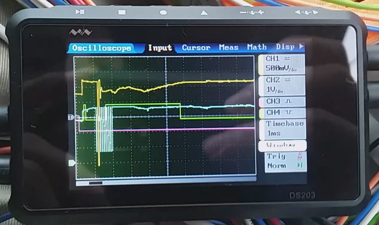
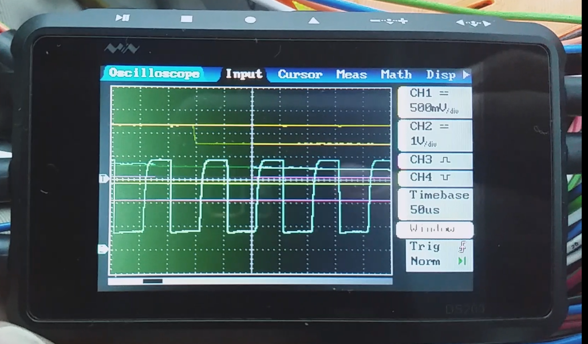
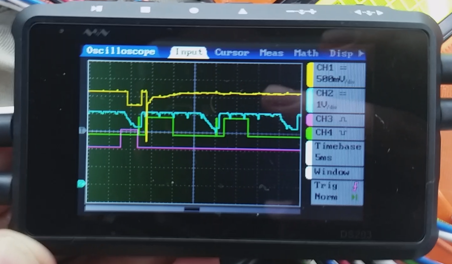
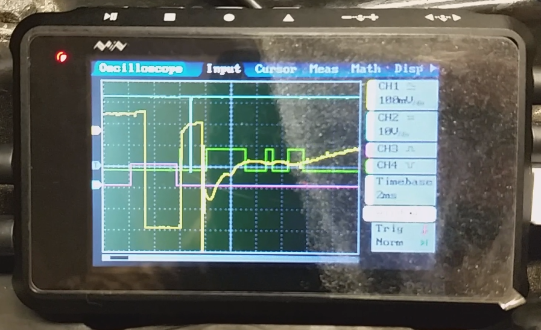
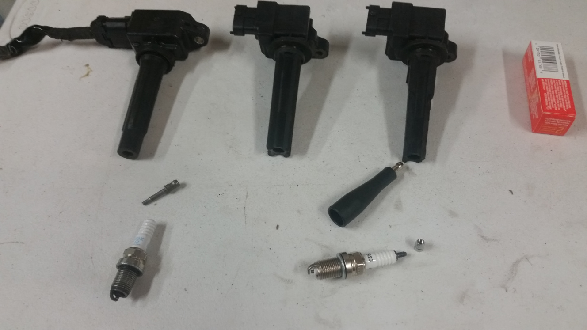
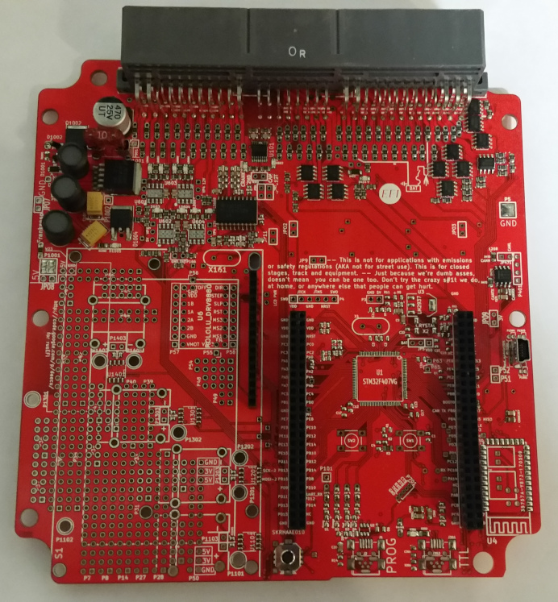
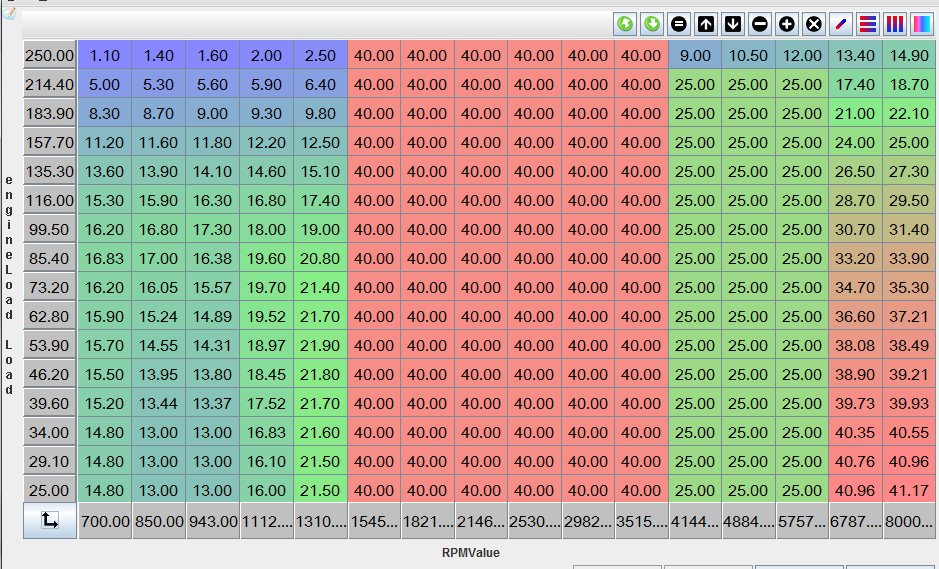
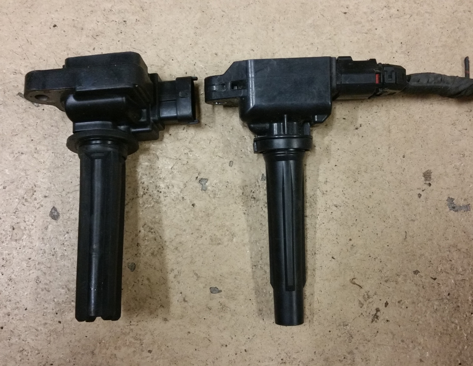

## Reverse Engineering Saab Trionic 8 Combustion Detection Module (CDM) output signals using rusEfi ECU

###### by Andrey Belomutskiy, 2018

* Table of contents
  * [Overview](https://github.com/rusefi/rusefi_documentation/tree/master/misc/Saab_Trionic_8_Combustion%20Detection%20Module_on_Mazda_Miata_running_rusEfi#overview)
  * [Hardware](https://github.com/rusefi/rusefi_documentation/tree/master/misc/Saab_Trionic_8_Combustion%20Detection%20Module_on_Mazda_Miata_running_rusEfi#hardware)
  * [Detonation test scenario](https://github.com/rusefi/rusefi_documentation/tree/master/misc/Saab_Trionic_8_Combustion%20Detection%20Module_on_Mazda_Miata_running_rusEfi#detonation-test-scenario)
  * [Detonation signals](https://github.com/rusefi/rusefi_documentation/tree/master/misc/Saab_Trionic_8_Combustion%20Detection%20Module_on_Mazda_Miata_running_rusEfi#detonation-signals)
* [Next Steps](https://github.com/rusefi/rusefi_documentation/tree/master/misc/Saab_Trionic_8_Combustion%20Detection%20Module_on_Mazda_Miata_running_rusEfi#next-steps)  
* [External links](https://github.com/rusefi/rusefi_documentation/tree/master/misc/Saab_Trionic_8_Combustion%20Detection%20Module_on_Mazda_Miata_running_rusEfi#external-links)

This data would not be gathered without help from kb1gtt, stefanst, andreika, nighthunter, hankthefourth and many others.

#### In this report we show how detonation on 2003 Mazda Miata MX-5 could be detected by means of ion sensing using Saab 55352173 Combustion Detection Module (CDM) and H6T60271 Individual Ignition Coils.

# TL;DR
knock and combustion detection outputs of 55352173 are digital. Knock is reported with a series of 50us pulses, more pulses
meaning more detonation. Combustion signal seems to be just a comparator giving logical true if ion sensing wire voltage is below certain level. First wide pulse on the combustion output seems to be flame front phase while second wide output
seems to be showing post-flame pressure, with the middle of this pulse correlating with moment of peak cylinder pressure.

Knocking - note a lot of blue line pulses (1ms timebase)

Knocking (50us timebase)

Not knocking or knocking way less - note lack of blue line low level pulses (5ms timebase)

Combustion signal seem to be just a comparator

[All the videos mentioned here](https://www.youtube.com/watch?v=1y1dXTg9iMg&list=PLwj_BUeepTNB6eddVd7_KtyqiFYOJ75jy)

# Overview

While Saab Trionic systems were using ion sense forever, only the latest eighth generation
uses individual ignition coils and external CDM. Prior to T8, a highly integrated ignition cassette was used which would
make repurposing it for DIY applications harder.
Trionic 8 system does not have camshaft position sensor or knock sensor with combustion detection module running on ion sensing
signal from ignition coil producing both phase and detonation detection.  

More recently, Mazda and BMW seem to be using ion sensing approach again.

### Hardware

Here are all the Saab components we will be using (only two coils pictured while four coils would be used)

Ferrari 124792 spark plug extension is used to connect original Mazda Miata spark plugs with bullet terminals removed with Saab COPs

[youtube: Hardware Details](https://youtu.be/rUZ_-_hRnDU)

[youtube: Hardware Overview](https://www.youtube.com/watch?v=1y1dXTg9iMg)

Knock detection wire has 0.8KOhm pull-up to 5v, combustion detection signal has 5KOhm pull-up to 5v.

### Detonation test scenario

2003 Mazda Miata 1.8 VVT Automatic running on rusEfi open source ECU.

Engine coolant temperature 100C, ambient temperature 4C, violent 40 degrees advance from 1500 RPM to 3500 RPM timing table.

Detonation is audible in 2000-4000 range with 50% throttle pulls from parked.

Detonation is also audible while parked, revving with brakes applied in "D" gear selector.

[youtube: It's knocking!](https://youtu.be/FQ9ii0eXjmA)

#### Detonation signals
[youtube: Four signals we see on the oscilloscope](https://youtu.be/7aafaZgr2AE)

[youtube: No detonation while driving - baseline](https://youtu.be/2fNrJ7NDFm8)

[youtube: Knocking while driving](https://youtu.be/eehx5zH8igI)

[youtune: Knocking while driving zoomed in](https://youtu.be/QXTaa1mGbwE)

[youtune: Knocking while standing on brakes 40 degrees timing](https://youtu.be/ylvMqOD50bY)

[youtube: No knocking while standing on brakes 25 degrees timing](https://youtu.be/jS3LXw_v9ls)

And that's it! We have seen enough to get some code for the rusEfi firmware to start consuming this knock singal data!

### Next Steps

1) Produce same outputs without CDM module

2) Try Mazda H6T61171 ignition coils - these are a bit longer and narrower, seem to fit my Miata engine.

3) analyze [raw waveforms](2018_01_05_miata_rigol.zip) and detect knock based on just ion sense signal without CDM

Inside of 55352173 Saab Ionization Detection Module

### External Links

[rusEfi Patreon](https://www.patreon.com/rusefi)

[rusEfi ECU](https://www.rusefi.com/)

[rusEfi forum](https://www.rusefi.com/forum/)

[rusEfi store](https://www.tindie.com/stores/russian/)

[Trionic 8](https://en.wikipedia.org/wiki/Trionic_8)

[Saab 9-3 wikipedia](https://en.wikipedia.org/wiki/Saab_9-3#Second_generation_(2003%E2%80%932014)) 

[Spark Advance Modeling and Control](http://www.fs.isy.liu.se/Publications/PhD/99_PhD_580_LE.pdf)